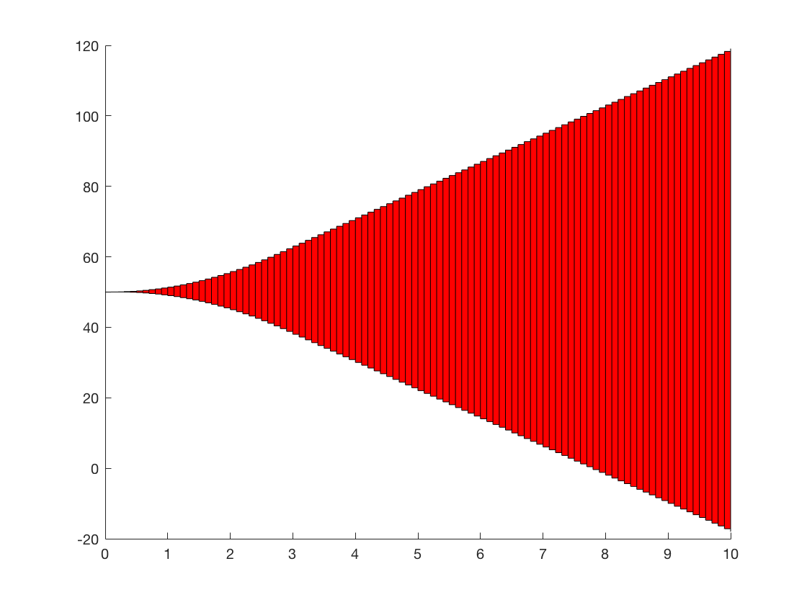

# From Matlab to SpaceEx 
In this repository, we provide a guide on how to interleave MATLAB modeling and SpaceEx reachability computations. The main functionalites involve (i) the cosntruction of SpaceEx model files (xml & cfg) for linear dynamical systems both in continuous and discrete time, (ii) the reachable set computations in SpaceEx (undertaken via MATLAB scripts), and (iii) post-processing of the reachable sets to obtain time-based state constraints for the target variables.


## Installing

To clone this repository:

```
git clone https://github.com/nikos-kekatos/Matlab-SpaceEx.git
```

This repository contains MATLAB functions and requires the Control System Toolbox.

To conduct reachability analysis, the executable SpaceEx file should be downloaded. We refer to the [official documentation](http://spaceex.imag.fr/download-6)
on how to install and run SpaceEx (binary) in your system; Linux and macOS are supported. Windows users could use a virtual machine or use the [web interface](http://spaceex.imag.fr/documentation/user-documentation/installing-spaceex-vm-server-17). A guide on how to run SpaceEx from the command line can be found [here](https://github.com/nikos-kekatos/SpaceEx-tutorials/blob/master/Documentation/Guide_SpaceEx.pdf). In the `startup_spaceex`, the exact path of SpaceEx should be specified.
The variable bounds are stored as MAT files. 

## Usage
We consider a linear dynamical system that is described by matrices A and B (standard notation). For obtaining the SpaceEx model, there are three main features.

	1. buildXMLandCFG(A,B): for building a continuous-time model
	 without any input or state constraints.
	2. buildXMLandCFG(A,B,dt): for building a discrete-time model
	without any input or state constraints (2 equivalent ways).
	3. buildXMLandCFG(A,B,dt,options): for building either a
	 continuous or discrete-time model with input/state constraints
	  and extra options.
Once the  SpaceEx model files (cfg and xml) are constructed, the user could call SpaceEx via ` system(spaceex -g model.cfg -m model.xml -o output.gen`to compute the reachable sets and store them in .GEN files (works in 2D and 3D). Note that the SpaceEx executable file should be downloaded and added to the MATLAB path.

The bounds of the state variables over discrete-time can obtained with the `findRange.m`.

To plot the reachable sets, use either the `plot_polygons_matlab` or `plot_2d_vertices_updated` function.
### Screenshots
For the double integrator example, the plots of variable *x1* over time are shown below.
 
 

## Updating

A comprehensive guide tailored to new `git` users can be found [here](https://fr.atlassian.com/git/tutorials/using-branches/). We refer to the [official site](https://git-scm.com/docs/user-manual.html) for all `git` commands.